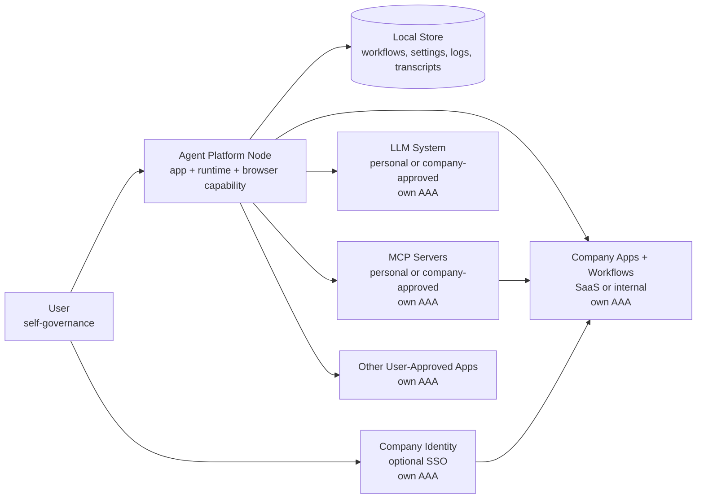
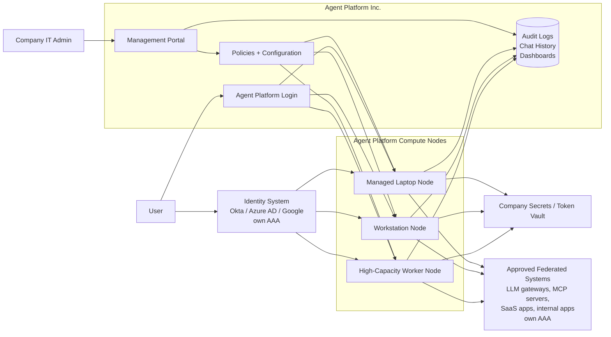

# Technical Design Document: Agent Platform

## Purpose

This document describes the high-level architecture for the Agent Platform. It covers:

1. Deployment strategy for Self-Managed and Company-Managed modes.
2. Architecture for constrained company environments.
3. Authentication and security model.
4. Connector strategy.
5. Audit-trail design.

This is intentionally a system-level design, not a component-level implementation spec.

## Clarifying "Firewall"

The term **firewall** is figurative in this product context. Modern enterprises do not operate behind one literal network wall. Many critical systems are SaaS products hosted by third parties, often on another cloud provider. Okta, Azure AD, Google Workspace, Salesforce, Workday, Slack, and many MCP providers may all live outside the company's physical network.

The relevant boundary is therefore not only a network firewall. It is the company's **security, identity, policy, audit, and data-governance boundary**.

The Agent Platform should respect that boundary by:

1. Authenticating users through company-approved identity.
2. Restricting which tools and connectors a workflow can use.
3. Preserving user identity when actions flow through SaaS connectors.
4. Auditing prompts, runs, tool calls, approvals, and outputs.
5. Operating through approved outbound paths rather than requiring broad inbound access.

## Architecture Principle: Federated Architecture

The Agent Platform is not a typical enterprise client-server application where most work happens in a central server and thin clients only render UI. It is better understood as a **federated architecture with distributed runtime compute**.

Each Agent Platform node provides runtime compute. A node may be a weak laptop, a developer workstation, a company-managed laptop, or a beefy enterprise worker machine. The main difference between nodes is capacity: a stronger node can run more workflows, larger workflows, or more concurrent workflows.

That said, even the beefiest Agent Platform node expends little compute compared with the backend LLM service. The node primarily coordinates workflow state, browser or connector access, prompts, tool calls, transcripts, and policy checks. The heavy reasoning and generation work happens in the LLM model infrastructure. In that sense, Agent Platform nodes are thin clients of the LLM while still being peers among themselves for workflow execution.

The systems the Agent Platform interacts with are independently governed peers in the broader federation:

1. Identity providers such as Okta, Azure AD, and Google.
2. SaaS applications such as Google Workspace, Slack, Salesforce, and Workday.
3. MCP servers and connector gateways.
4. LLM providers or company LLM gateways.
5. Internal applications and data systems.

Each peer brings its own authentication, authorization, and audit controls. The Agent Platform does not replace those AAA systems. It coordinates work across the federation while respecting each system's policies and preserving identity where possible.

Governance is a separate plane. In Self-Managed mode, the user governs their own node. In Company-Managed mode, Company IT governs nodes through Agent Platform Inc.'s management portal by defining configuration, connector allowlists, logging requirements, and security policies. This architecture is similar to how some Chrome profiles are managed by Company IT while personal ones are self-managed. Similarly, a work MacBook is restricted by Company IT while a personal one is not, even though they are the same product.

## High-Level Architecture

At the system level, an **Agent Platform node** is one product boundary. It includes the workflow builder, Agent Runtime, local policy controls, transcript/log capture, connector clients, and browser capability. The browser would ideally be builtin but could also be an independent sidecar; that is an implementation choice inside the Agent Platform node boundary.

### Self-Managed Mode

In Self-Managed mode, the end user manages the same Agent Platform product. This is the PoC and bottom-up adoption path.

Self-Managed does **not** mean "outside the company." If the user signs in through company SSO or into company SaaS accounts, the Agent Platform node can access the company apps, data, and workflows that the user is already authorized to access. Those company systems still enforce their own AAA, so they remain behind the company's virtual firewall even when the Agent Platform node is self-managed.

This is why Self-Managed mode is a zero-integration wedge: it lets employees use the Agent Platform with company apps without requiring Company IT to deploy, configure, or approve the Agent Platform first. The difference from Company-Managed mode is governance of the Agent Platform node itself, not whether company systems are reachable.

Key properties:

1. Runs on the user's laptop or desktop as a compute node in the federation.
2. Stores workflows, settings, logs, and transcripts locally by default.
3. Can access company apps and company workflows when the user authenticates through company SSO or company app accounts.
4. Uses the user's existing access to websites and optional connector credentials.
5. Requires outbound access to the selected LLM provider or company LLM gateway, plus any web apps or MCP servers used by the workflow.
6. The end user controls which LLM endpoints, MCP servers, and tools are configured, unless those choices are constrained by the downstream systems themselves.

### Company-Managed Mode

In Company-Managed mode, Company IT manages or constrains the same Agent Platform product through **Agent Platform Inc.'s management portal**. Company IT logs into Agent Platform Inc., defines policies and configuration there, reviews audit logs and dashboards there, and delegates access to employees. Agent Platform Inc. stores audit logs, chat history, policy, and configuration on the company's behalf.

End users must also log into the Agent Platform product before using a Company-Managed Agent Platform node. After that, the node can still interact with federated systems such as company SSO, SaaS apps, MCP servers, and LLM endpoints. This is analogous to a company-managed Chrome profile or remotely managed work laptop: the product is essentially identical, but policy, logging, connectors, and configuration are governed through the vendor-managed control plane.

Key properties:

1. Users (probably) authenticate to the Agent Platform's work account before using a Company-Managed account (like logging into work Gmail).
2. Users may also authenticate through company identity and downstream app identity, even when those identity providers are themselves SaaS products.
3. Company IT manages policy and configuration through Agent Platform Inc.'s management portal.
4. Agent Platform Inc. stores audit logs, chat history, dashboards, policy, and configuration on the company's behalf.
5. Company IT can constrain settings, policies, connector allowlists, LLM endpoints, and tool access through the Agent Platform Inc. control plane.
6. Audit logs, including chats and tool-call history, are available in Agent Platform Inc.'s portal and can optionally be exported to the company's log store, SIEM, or data lake.
7. Connector credentials and OAuth tokens are managed by company-approved secrets infrastructure when required.
8. Runtime compute is distributed across Agent Platform nodes; stronger nodes can run more workflows, but they follow the same governance model.

## Deployment Strategy

### Self-Managed Deployment

The Self-Managed deployment prioritizes ease of installation and immediate utility:

1. Local Agent Platform node.
2. Local runtime compute.
3. Local persistence.
4. Local browser capability (builtin or sidecar).
5. User-provided LLM and connector credentials.

This version is appropriate where local storage and governance is acceptable.

### Company-Managed Deployment

The Company-Managed deployment prioritizes governance without requiring a fundamentally different product:

2. Company IT defines approved configuration, connector allowlists, LLM endpoints, tool access, and security policies in that portal at Agent Platform Inc.'s management portal (SaaS).
3. End users authenticate to their Agent Platform work accounts before using Company-Managed nodes.
4. Users may also authenticate through company identity and downstream app identity as required by the federated systems they access.
5. Logs, chat transcripts, audit trails, dashboards, policies, and configuration are stored by Agent Platform Inc. on the company's behalf.
6. Audit data can optionally be exported to company systems such as SIEM, data lake, or log store.
7. Secrets and OAuth tokens can live in company-approved vault infrastructure when required.
8. Runtime compute is still provided by Agent Platform nodes, which may be heterogeneous laptops, workstations, or managed worker machines.

The node should not require unusual inbound network access. It should primarily make outbound calls to approved LLM endpoints, MCP servers, SaaS APIs, and browser targets.

## Authentication and Security Model

The security model is federated across systems. AAA is not supplied by a single central Agent Platform server.

In Self-Managed mode, the user is the local operator. The app relies on local machine security and user-provided credentials.

In Company-Managed mode:

1. The user (probably) authenticates to the Agent Platform account first.
2. The user authenticates through company SSO where company identity is needed.
3. Platform authorization determines which workflows, runs, tools, and connectors the user can access.
4. Downstream applications enforce their own authentication, authorization, and audit controls.
5. Connector calls should preserve end-user identity when supported by the downstream system.
6. Sensitive writes can require human approval.
8. Policies can restrict tools, connectors, domains, data classes, and action types.

The important design point is that the Agent Platform does not replace company identity, SaaS identity, or application-level AAA systems. It becomes a controlled execution layer that coordinates across the federated systems while respecting their own controls.

## Connector Strategy

The connector strategy has three tiers.

### 1. Browser-Based Access

Browser access is the broadest compatibility path. If a user can perform a workflow in a web app, the Agent Platform can often read or interact with that app through the browser.

Browser reads are generally safer and more reliable than browser writes. UI-based writes are clunky, expensive, slow and error prone.

### 2. MCP and Structured Connectors

MCP provides a common protocol for connecting to SaaS and internal systems while allowing the platform to centralize policy, token management, and audit. MCP providers are very mature at this point, with Zapier and Cloudflare providing thousands of actions. That said, they're still traditional software and therefore still brittle.

Examples:

1. Google Sheets updates.
2. Slack messages.
3. Jira or Linear tickets.
4. GitHub operations.
5. Internal systems exposed through company-approved MCP servers.

## Audit-Trail Design

In Company-Managed mode, audit records, chat history, and dashboards are stored by Agent Platform Inc. (SaaS) on the company's behalf. They should also be exportable to company SIEM, data-lake, or log-store infrastructure and should support retention, redaction, and tamper-evidence requirements.

The run transcript is useful for debugging and user review. The Agent Platform audit trail is the platform compliance record. Downstream federated systems, such as Google Workspace, Slack, or internal apps, may also produce their own audit records for the same action.

## Summary

The Agent Platform should be understood as a governed, distributed execution layer for agentic workflows. It does not need to sit behind a literal company firewall to provide company control. Instead, it participates in the company's trust model: identity, policy, connector approval, secrets management, and audit.

Self-Managed mode is a zero-integration wedge. Company-Managed mode keeps the product experience nearly identical while adding an IT governance plane: managed configuration, connector constraints, security policies, managed secrets, audit storage, dashboards, and optional audit export.
